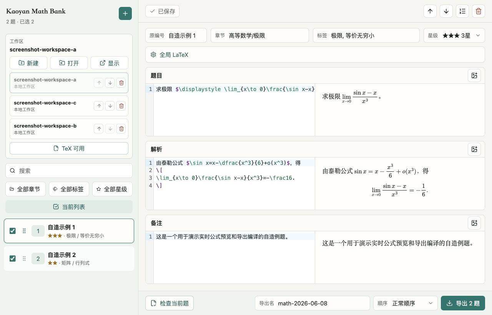

# Kaoyan Math Bank

A local-first desktop question bank for writing, previewing, checking, organizing, and exporting postgraduate mathematics problems in LaTeX.

一个本地优先的考研数学题库桌面应用，用于编写、预览、检查、整理和导出 LaTeX 题目。



## Features / 功能

- Write each item in three independent LaTeX modules: question, solution, and note.
- Preview formulas instantly with MathJax and attach PNG or JPEG images.
- Run a real XeLaTeX check for the current item. Results are bound to the item and its content version, so editing or switching items cannot leave a misleading success state.
- Organize questions with source IDs, chapters, tags, stars, search, filters, selection, and drag-and-drop ordering.
- Export the selected questions as `questions.tex`, `questions.pdf`, `full.tex`, and `full.pdf`.
- Use normal order or reproducible random order with a saved seed.
- Manage multiple local workspaces without uploading question content to a server.
- Rely on automatic saving, atomic file replacement, backups, and history snapshots for recovery.

- 每道题分为题目、解析、备注三个独立的 LaTeX 模块。
- 使用 MathJax 即时预览公式，并可插入 PNG 或 JPEG 图片。
- 对当前题执行真实的 XeLaTeX 检查。检查结果与题目及内容版本绑定，编辑内容或切换题目后不会继续显示误导性的成功状态。
- 使用原编号、章节、标签、星级、搜索、筛选、勾选和拖拽排序管理题目。
- 将已选题目导出为 `questions.tex`、`questions.pdf`、`full.tex` 和 `full.pdf`。
- 支持正常顺序和带种子的可复现随机顺序。
- 管理多个本地工作区，题目内容不会上传到服务器。
- 通过自动保存、原子写入、备份和历史快照保护数据。

## Requirements / 环境要求

The application does not bundle a TeX distribution. Install one before using compile checks or PDF export.

应用不内置 TeX 发行版。使用编译检查或 PDF 导出前，请先安装 TeX。

| Platform | Recommended TeX distribution | Required commands |
| --- | --- | --- |
| macOS | MacTeX or BasicTeX | `latexmk`, `xelatex` |
| Windows | MiKTeX or TeX Live | `latexmk.exe`, `xelatex.exe` |
| Linux | TeX Live | `latexmk`, `xelatex` |

After installation, confirm that XeLaTeX is available:

安装完成后，确认 XeLaTeX 可用：

```bash
latexmk --version
xelatex --version
```

The application checks `PATH` and common installation locations automatically. If TeX is installed elsewhere, set the `latexmk` path in `Global LaTeX`.

应用会自动检查 `PATH` 和常见安装位置。若 TeX 安装在其他位置，可在“全局 LaTeX”中填写 `latexmk` 路径。

## Install / 安装

Download the installer for your platform from [GitHub Releases](https://github.com/zyvwang/kaoyan-math-bank/releases):

从 [GitHub Releases](https://github.com/zyvwang/kaoyan-math-bank/releases) 下载对应平台的安装包：

- macOS: `.dmg`
- Windows: `.exe`

The installers are currently unsigned and not notarized. On macOS, if Finder reports that the application is damaged, install it in `/Applications` and run:

当前安装包尚未签名或公证。若 macOS 提示应用已损坏，请先将其安装到 `/Applications`，再运行：

```bash
xattr -dr com.apple.quarantine "/Applications/Kaoyan Math Bank.app"
```

Then open the application again.

随后重新打开应用。

## Quick Start / 快速上手

1. Launch the application and create a workspace or choose an existing workspace folder.
2. Click `+` to create a question.
3. Fill in the source ID, chapter, tags, and star rating as needed.
4. Write the question, solution, and note in their corresponding tabs.
5. Add shared packages, commands, or document settings in `Global LaTeX`.
6. Click `Check Current Item` to run a real XeLaTeX compile.
7. Select the questions you need, choose an order, and export the four output files.

1. 启动应用，新建工作区或选择已有工作区文件夹。
2. 点击 `+` 新建题目。
3. 按需填写原编号、章节、标签和星级。
4. 在对应标签页中编写题目、解析和备注。
5. 在“全局 LaTeX”中添加共享宏包、命令或文档设置。
6. 点击“检查当前题”，执行真实的 XeLaTeX 编译。
7. 勾选需要的题目，选择顺序并导出四个结果文件。


## Writing LaTeX / 编写 LaTeX

Write body fragments rather than complete documents. The application supplies the document shell during compile checks and export.

请输入正文片段，不要编写完整文档。编译检查和导出时，应用会自动补齐文档结构。

```tex
已知函数 $f(x)=x^2$，求 $f'(x)$。
```

For display mathematics:

行间公式示例：

```tex
\[
\int_0^1 x^2\,dx=\frac{1}{3}.
\]
```

Use `Global LaTeX` for shared packages and commands:

共享宏包和命令请写入“全局 LaTeX”：

```tex
\usepackage{amssymb}
\newcommand{\R}{\mathbb{R}}
```

The live preview is designed for fast editing. `Check Current Item` and export use the installed XeLaTeX engine and are the authoritative checks for the generated document.

即时预览用于快速编辑；“检查当前题”和导出使用本机安装的 XeLaTeX，最终结果以真实编译为准。

## Export / 导出

Each successful export creates a folder under the current workspace:

每次成功导出都会在当前工作区中生成一个目录：

```text
exports/
└── math-2026-06-13-1/
    ├── questions.tex
    ├── questions.pdf
    ├── full.tex
    └── full.pdf
```

- `questions.*` contains question statements only.
- `full.*` contains questions, solutions, and notes.
- The default name uses `math-YYYY-MM-DD-N`. The number starts at `1` and advances to the next unused sequence in that workspace.
- A custom export name remains unchanged after export.
- Normal order follows the list order. Random order stores a seed so the same order can be reproduced.
- After export, choose `Open File Location` to reveal the output folder in Finder, File Explorer, or the Linux file manager.

- `questions.*` 仅包含题目。
- `full.*` 包含题目、解析和备注。
- 默认名称采用 `math-YYYY-MM-DD-N`。序号从 `1` 开始，并自动使用当前工作区中的下一个可用序号。
- 手动修改导出名后，成功导出不会改变该名称。
- 正常顺序遵循列表顺序；随机顺序会保存种子，便于复现同一排列。
- 导出完成后，可点击“打开文件位置”，在 Finder、文件资源管理器或 Linux 文件管理器中定位结果目录。

The four files are first generated in a temporary staging directory. Existing output with the same name is replaced only after both PDFs compile successfully, so a failed export does not destroy the previous successful result.

四个文件会先在临时目录中生成。只有两个 PDF 都编译成功后，同名旧结果才会被替换，因此导出失败不会破坏此前成功的结果。

## Workspace and Data / 工作区与数据

A workspace is a normal folder that you control:

工作区是由你自行管理的普通文件夹：

```text
workspace/
├── bank.json
├── bank.json.bak
├── assets/
├── exports/
└── .history/
```

- `bank.json` stores questions, metadata, selection, order, and workspace settings.
- `assets/` stores uploaded images using generated filenames.
- `exports/` stores successful export folders.
- `bank.json.bak` and `.history/` provide recovery points.

- `bank.json` 保存题目、元数据、勾选状态、顺序和工作区设置。
- `assets/` 使用生成的文件名保存上传图片。
- `exports/` 保存成功导出的目录。
- `bank.json.bak` 和 `.history/` 提供恢复点。

Edits are saved automatically. Writes use revision checks and atomic replacement to reduce the risk of conflicting or partial saves. When recovery data is available, the application can restore a recent valid snapshot.

编辑内容会自动保存。写入过程使用版本检查和原子替换，降低冲突写入或文件不完整的风险；发现可用恢复数据时，应用可以恢复最近的有效快照。

Question content stays inside the workspace. The application only stores lightweight preferences, such as recently opened workspace paths and a custom TeX executable path, in its local application data.

题目内容始终保存在工作区内。应用只会在本地应用数据中记录最近打开的工作区路径、自定义 TeX 可执行文件路径等轻量设置。

The application does not provide cloud synchronization. To synchronize a workspace, place the folder in a storage system you trust and avoid editing the same workspace on multiple machines at the same time.

应用不提供云同步。如需同步，可将工作区放入可信的存储系统中，并避免多台设备同时编辑同一工作区。

## Development / 开发

Development requires Node.js 24.

开发环境需要 Node.js 24。

```bash
npm install
npm run dev
```

Open `http://127.0.0.1:61094` for the local web interface.

打开 `http://127.0.0.1:61094` 使用本机网页界面。

Run the Electron development build:

启动 Electron 开发版：

```bash
npm run desktop:dev
```

Run the full verification suite:

运行完整验证：

```bash
npm run verify
```

Run the packaged desktop smoke test:

运行打包后的桌面冒烟测试：

```bash
npm run test:desktop
```

## Packaging and Release / 打包与发布

Build a macOS installer on macOS:

在 macOS 上构建 macOS 安装包：

```bash
npm run dist:mac
```

Build a Windows installer on Windows:

在 Windows 上构建 Windows 安装包：

```bash
npm run dist:win
```

The GitHub Actions release workflow builds both platforms when a tag matching `v*` is pushed. It creates a draft GitHub Release containing the generated installers for review before publication.

推送符合 `v*` 格式的标签后，GitHub Actions 会构建两个平台的安装包，并创建包含产物的 GitHub Release 草稿，确认后再正式发布。

## FAQ / 常见问题

### Why is TeX not bundled? / 为什么不内置 TeX？

A TeX distribution is large and has its own update and package-management lifecycle. Using the system installation keeps the application smaller and lets you manage packages normally.

TeX 发行版体积较大，也有独立的更新和宏包管理机制。使用系统安装可以减小应用体积，并保留正常的宏包管理方式。

### Can I commit my workspace to a public repository? / 可以把工作区提交到公开仓库吗？

Only if you have the right to publish every question, solution, note, and image in it. Keep copyrighted or private content out of public repositories.

只有在你拥有全部题目、解析、备注和图片的公开权利时才可以。请勿将受版权保护或私有的内容提交到公开仓库。

### Is cloud sync supported? / 支持云同步吗？

No. Kaoyan Math Bank is local-first and does not include a cloud account or synchronization service.

不支持。Kaoyan Math Bank 是本地优先应用，不包含云账户或同步服务。

## License

[MIT](LICENSE)
